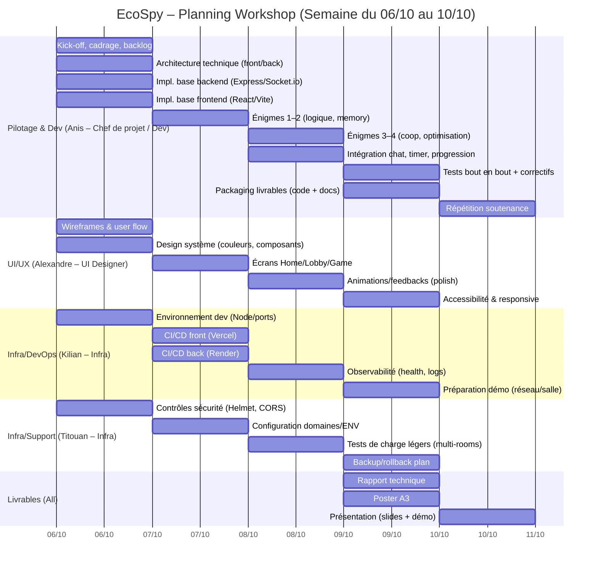

# 📅 Gantt – Gestion de projet (06/10 → 10/10)

Notes:
- Les durées sont indicatives (0.5d = demi‑journée).
- Dépendances principales: UI précède intégrations; infra débloque les déploiements; Anis coordonne et intègre.
