# 📅 Gantt – Gestion de projet (06/10 → 10/10)

```mermaid
gantt
    title EcoSpy – Planning Workshop (Semaine du 06/10 au 10/10)
    dateFormat  YYYY-MM-DD
    axisFormat  %d/%m

    section Pilotage & Dev (Anis – Chef de projet / Dev)
    Kick-off, cadrage, backlog             :a1, 2025-10-06, 1d
    Architecture technique (front/back)    :a2, 2025-10-06, 0.5d
    Impl. base backend (Express/Socket.io) :a3, 2025-10-06, 0.5d
    Impl. base frontend (React/Vite)       :a4, 2025-10-06, 0.5d
    Énigmes 1–2 (logique, memory)          :a5, 2025-10-07, 1d
    Énigmes 3–4 (coop, optimisation)       :a6, 2025-10-08, 1d
    Intégration chat, timer, progression   :a7, 2025-10-08, 0.5d
    Tests bout en bout + correctifs        :a8, 2025-10-09, 0.5d
    Packaging livrables (code + docs)      :a9, 2025-10-09, 0.5d
    Répétition soutenance                  :a10, 2025-10-10, 0.5d

    section UI/UX (Alexandre – UI Designer)
    Wireframes & user flow                 :u1, 2025-10-06, 0.5d
    Design système (couleurs, composants)  :u2, 2025-10-06, 0.5d
    Écrans Home/Lobby/Game                 :u3, 2025-10-07, 1d
    Animations/feedbacks (polish)          :u4, 2025-10-08, 0.5d
    Accessibilité & responsive             :u5, 2025-10-09, 0.5d

    section Infra (Kilian & Titouan)
    Setup environnement dev (Node/ports)   :i1, 2025-10-06, 0.5d
    Déploiement front minimal (Vercel)     :i2, 2025-10-07, 0.5d
    Déploiement back minimal (Render)      :i3, 2025-10-07, 0.5d
    Vérifs basiques (health, accès)        :i4, 2025-10-08, 0.5d

    section Livrables (All)
    Rapport technique                      :l1, 2025-10-09, 0.5d
    Poster A3                              :l2, 2025-10-09, 0.5d
    Présentation (slides + démo)           :l3, 2025-10-10, 0.5d
```

Notes:
- Infra réduite à l’essentiel: environnement, déploiements simples, vérification health.
- Le reste se concentre sur dev/UX et préparation des livrables/soutenance.
